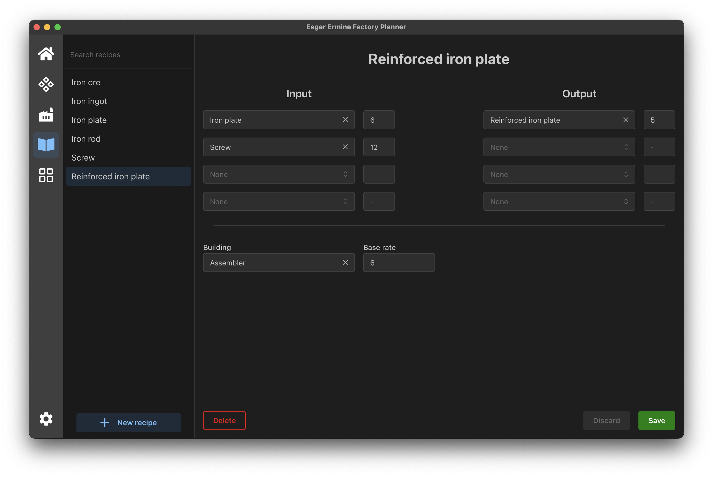
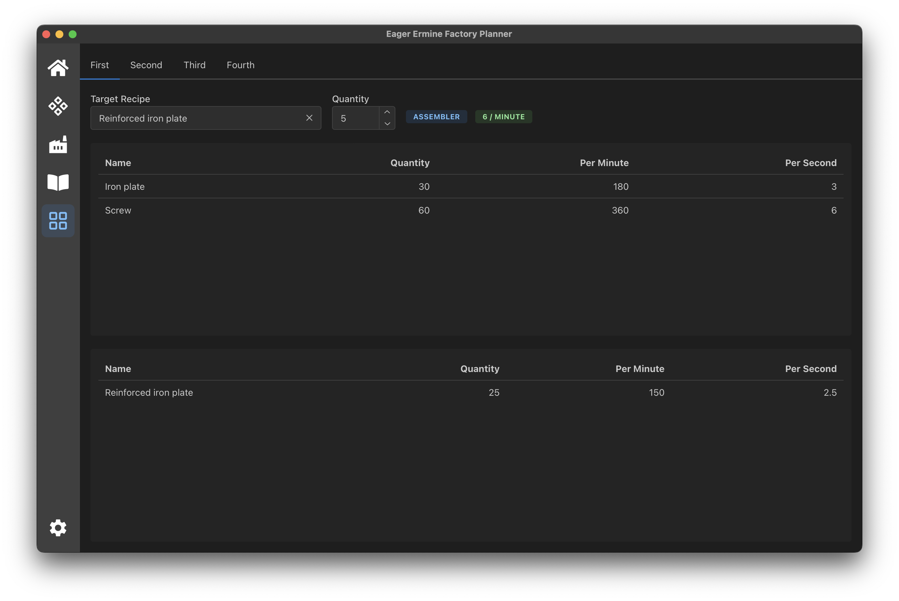

# Eager Ermine Factory Planner
A simple factory and logistics planner for both Factorio and Satisfactory! 
Although recipes are limited to four inputs and outputs.

**Be warned, this codebase is currently lacking unit testing of any kind.**

# How?
**Tauri + Vite + Mantine + TypeScript**  
 
The following command runs the development version of the application:  
`pnpm tauri dev`  

# Screenshots

